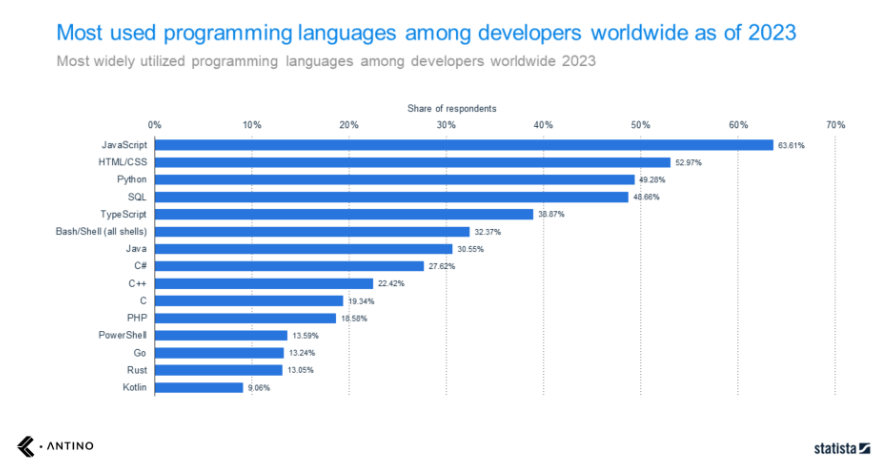
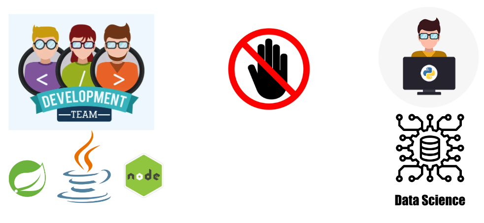
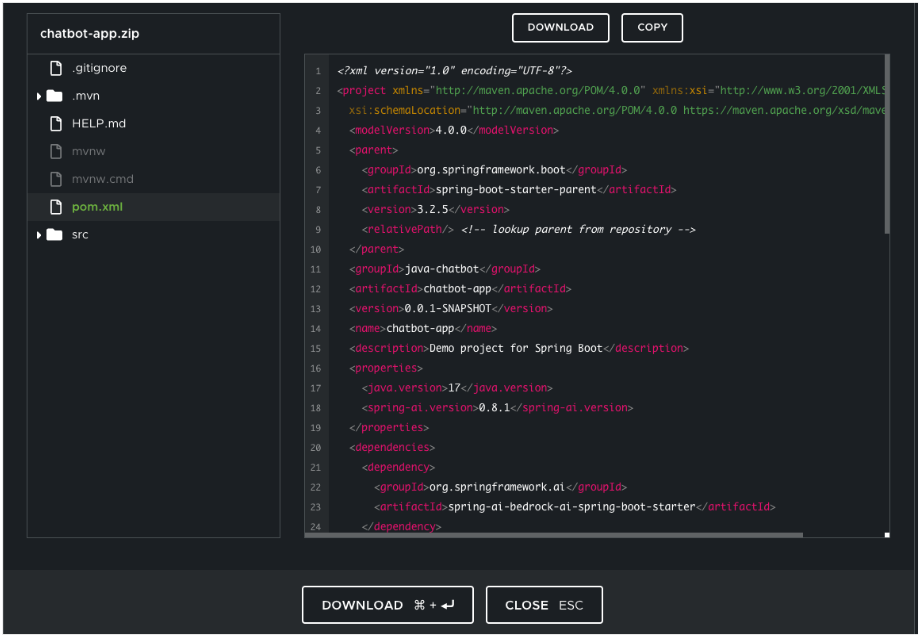

# Spring AI Workshop for AWS Bedrock

## Introduction to Spring
**TLDR:** Spring is a set of libraries that are used to deliver Java applications in modern frameworks such as web app, cloud native containers, and streaming architectures.

**Longer Version**
_Java_ is one of the most popular development languages used by enterprises today.  It is arguably the most prevelant language for large enterprises, and there is a huge number of legacy applications written in Java.  However, the J2EE style of deployment was not well suited to modern architectures, especially web apps.  

The [Spring Framework](https://spring.io) was developed as a means of giving developers tools to solve these problems.  The core features can be used by any Java application and supports a variety of Java versions.  The Spring Framework could be viewed as extensions for building web applications on top of Java EE (Enterprise Edition). 

Spring Framework is free and open source, although [commercial support](https://tanzu.vmware.com/spring-runtime) is provided by Tanzu by Broadband.  Spring is extremely popular in the Java community. Since it's introduction in 2002 adoption has grown steadily.  On average, there are over 1,000,000 Spring downloads every month.

Since it's initial introduction,  the Spring project has expanded to include React front ends, Serverless, Event Driven, Data Flow, Security and [more](https://spring.io/projects).  In this workshop we will focus on the [Spring AI project](https://spring.io/projects/spring-ai).

## Why Use Spring AI instead of Python?
Python is one of the most widely used languages for data science, and when it comes to GenAI use cases there are some very good libraries available for developers.  However, not all development shops will have Python expertise handy.  Also, many application that are adopting GenAI components are not, strictly speaking, data science apps.  

Let's imagine that a particular application is already written in Java, and has a requirement to add an interactive chatbot employing LLM to the existing app.  In this case, the Development team could either try to request Python expertise and resources from the Data Science team, or write the chatbot themselves using the languages they are already using.   Chances are the Development team is already using Spring in their Java application.  Adding in the Spring AI compnents offers a seamless way to enable the Development team to work with LLMs without being Data Science experts.

Many Spring projects begin in the [Spring Initializer](https://start.spring.io/).   Here it is easy for the team to add libraries needed to develop in AWS Bedrock.  They simply name the project, select the packaging and Java version, then add the AWS Bedrock libraries from Spring AI. (_Note: this is for illustrative purposes; the Development team could also simply add the Bedrock package to their existing java project_)

Once selections are complete, the team simply download the files.  All the necessary packages are available and it is simply a matter of writing the final code.  NOTE: this is a great place for [AWS Q Developer](https://aws.amazon.com/q/developer/) to help speed up the application.

<!-- 

 -->

## In this Workshop
This workshop will start with all the necessary libraries downloaded and installed.  We have provided the above for context on how and why an enterprise would find Spring AI appealing.  

To see this process run through from start to finish, check out [this video](https://youtu.be/yyvjT0v3lpY?si=fnvPXYO1q9DCYzyh), or [this video](https://youtu.be/aNKDoiOUo9M?si=Zq_DSupQZghgPGQM).

As you work through the following exercises, please take the time to review the details of how the Spring packages are configured to use AWS Bedrock LLMs.  We have added some extra code detail on each README file.  The goal is to explain how GenAI types of tasks can be completed in just a few lines of code using the Spring AI framework.

